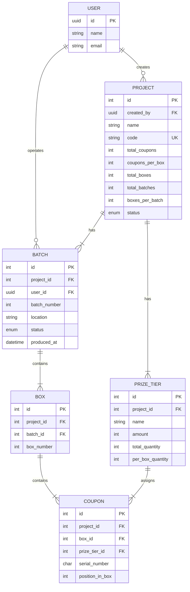

# Coupon Production System

An internal admin tool for managing **instant-prize coupon campaigns** — from campaign configuration to randomized coupon generation, distribution reporting, and Excel export.

## Quick Start

> **Requires [PHP 8.4+](https://php.net/releases/), [Node.js 20+](https://nodejs.org/), and [Composer](https://getcomposer.org/).**

```bash
# Clone the repository
git clone https://github.com/masbekkk/coupoun-system.git
cd coupoun-system

# Install dependencies
composer install
npm install

# Setup environment
cp .env.example .env
php artisan key:generate

# Run database migrations
php artisan migrate

# Start the development server
composer dev
```

The app will be available at `http://localhost:8000`.

## Features

- **Project Management** — Create and configure coupon campaigns with custom prize tiers
- **Randomized Coupon Generation** — Generate coupons with fair, randomized prize distribution across boxes
- **Batch Production** — Split large campaigns into production batches for phased manufacturing
- **Distribution Reports** — View per-box prize distribution to verify allocation fairness
- **Excel Export** — Download coupon data as `.xlsx` files for physical production
- **Dashboard Analytics** — Overview of all projects, batches, and coupon counts
- **Dark Mode** — Light, Dark, and System theme support

## Tech Stack

| Layer | Technology |
|-------|-----------|
| Backend | Laravel 13, PHP 8.4 |
| Frontend | React, Inertia.js v3, TypeScript |
| Styling | Tailwind CSS, shadcn/ui |
| Database | SQLite (default), MySQL/PostgreSQL supported |
| Auth | Laravel Fortify (session-based) |
| Testing | Pest v5 |
| Code Quality | Pint, Rector, Larastan, OxLint |

## Domain Concepts

```
Project
├── Prize Tiers (1..N)       — prize levels with amounts and per-box quantities
├── Batches (1..N)           — production runs assigned to operators
│   └── Boxes (1..N)         — physical boxes within each batch
│       └── Coupons (N)      — individual coupons with serial numbers
```

| Term | Description |
|------|-------------|
| **Project** | A campaign configuration defining total coupons, box structure, and prize tiers |
| **Prize Tier** | A prize level (e.g., "Rp 100,000", "No Prize") with a per-box quantity |
| **Batch** | A production run — generates coupons for a subset of boxes |
| **Box** | A physical box containing exactly `coupons_per_box` coupons |
| **Coupon** | An individual coupon with a unique serial number and assigned prize |

## Database Schema



### Status Lifecycle

**Project:** `draft` → `generating` → `ready` → `in_production` → `completed`

**Batch:** `pending` → `in_progress` → `completed`

## Business Logic

### Project Creation
1. Project code must be unique (max 30 characters)
2. Sum of all `per_box_quantity` across prize tiers **must equal** `coupons_per_box`
3. Creating a project auto-creates N empty batches (status: `pending`)

### Coupon Generation
1. Only batches with `pending` status can be generated
2. Prizes are **randomized within each box** — no two adjacent same-value winning coupons
3. Serial numbers are zero-padded to 5 characters (`00001`, `00002`, etc.)
4. Box numbers are globally sequential across batches
5. When all batches complete, project status transitions to `ready`

### Project Deletion
- Cascade deletes all associated batches, boxes, coupons, and prize tiers

## API Reference

All endpoints are prefixed with `/api/v1` and require authentication (`auth:sanctum` middleware).

| Method | Endpoint | Description |
|--------|----------|-------------|
| `GET` | `/api/user` | Current authenticated user |
| `GET` | `/api/v1/dashboard/stats` | Dashboard statistics + recent projects |
| `GET` | `/api/v1/projects` | List all projects (paginated) |
| `POST` | `/api/v1/projects` | Create project with prize tiers |
| `GET` | `/api/v1/projects/{id}` | Project detail with prize tiers |
| `DELETE` | `/api/v1/projects/{id}` | Delete project permanently |
| `GET` | `/api/v1/projects/{id}/batches` | List batches for a project |
| `GET` | `/api/v1/projects/{id}/coupons` | List coupons (filtered, paginated) |
| `GET` | `/api/v1/projects/{id}/coupons/export` | Export coupons as Excel |
| `POST` | `/api/v1/batches/{id}/generate` | Generate coupons for a batch |
| `GET` | `/api/v1/batches/{id}/report` | Batch distribution report |

> For detailed request/response JSON schemas, see [api_specification.md](./api_specification.md).

### Coupon Query Parameters

| Parameter | Type | Default | Description |
|-----------|------|---------|-------------|
| `tier_id` | int | — | Filter by prize tier |
| `batch_id` | int | — | Filter by batch |
| `search` | string | — | Search by serial number |
| `sort` | string | `asc` | Sort order (`asc` / `desc`) |
| `per_page` | int | `50` | Results per page (max 500) |
| `page` | int | `1` | Page number |

## Configuration

| Variable | Description | Default |
|----------|-------------|---------|
| `APP_NAME` | Application name | `Laravel` |
| `APP_URL` | Application URL | `http://localhost` |
| `DB_CONNECTION` | Database driver | `sqlite` |
| `SESSION_DRIVER` | Session storage | `database` |
| `QUEUE_CONNECTION` | Queue driver | `database` |

## Available Commands

### Development
- `composer dev` — Start Laravel server, queue worker, log watcher, and Vite dev server

### Code Quality
- `composer lint` — Run Rector, Pint, and Oxfmt formatters
- `composer test:lint` — Dry-run mode for CI/CD

### Testing
- `composer test` — Full test suite (types, coverage, linting, static analysis)
- `composer test:unit` — Run Pest tests with coverage
- `composer test:types` — PHPStan at level 9

## Documentation

- [API Specification](./api_specification.md) — Detailed endpoint schemas with JSON examples
- [Mobile App Spec](./MOBILE_APP_SPEC.md) — Full specification for building a mobile client

## License

This project is open-sourced software licensed under the [MIT license](https://opensource.org/licenses/MIT).
